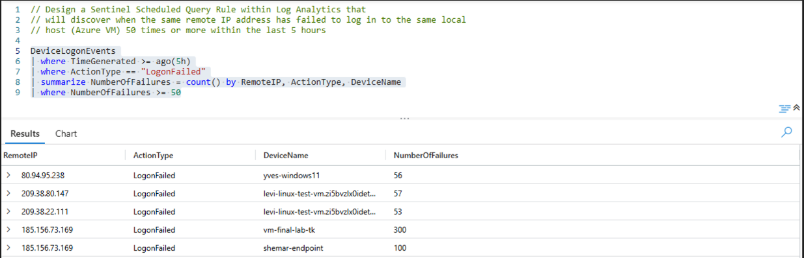

# 🚨 Incident Response: Brute Force Attempt Detection


---

## Scenario
As a security analyst for an organization, I observed multiple failed authentication attempts across several virtual machines in our environment. The activity suggested a possible brute force attack from multiple external IPs. 

My goal is to investigate, detect, and mitigate this potential threat in compliance with **NIST 800-61** guidelines.

---

## 🛠️ **Platforms and Tools**
- **Microsoft Sentinel**
- **Microsoft Defender for Endpoint**
- **Kusto Query Language (KQL)**
- **Windows 10 Virtual Machines (Microsoft Azure)**

---

## 🔍 **Objective: Find Brute Force and Create Sentinel Scheduled Query Rule**
Implement a **Sentinel Scheduled Query Rule** using KQL in Log Analytics to detect when the same remote IP address fails to log in to the same Azure VM 50+ times within a 5-hour period.

NOTE: This project was done in the [Cyber Range](http://joshmadakor.tech/cyber-range) which simulates an enterprise environment.
---

### **Step 1: Create Alert Rule** 

I designed a Sentinel Scheduled Query Rule within Log Analytics that will discover when the same IP address has failed to login to the same local host (Azure VM) 50 or more times within the last 5 hours.

**Detection Query:**

```kql
DeviceLogonEvents
| where TimeGenerated >= ago(5h)
| where ActionType == "LogonFailed"
| summarize NumberOfFailures = count() by RemoteIP, ActionType, DeviceName
| where NumberOfFailures >= 50
```
Sample output:


---

## **Incident Response Phases**
### 1️⃣ Preparation
1. **Policies and Procedures:**
   - Establish protocols for handling brute-force attempts, account lockouts, and account recovery.
   - Include predefined actions for notifications, account lockdowns, and reporting suspicious activity.

2. **Access Control and Logging:**
   - Enable logging of all login attempts across Azure AD.
   - Integrate with **Microsoft Defender for Identity** and **Azure Sentinel** for automated detection and alerts.

3. **Training:**
   - Train the security team to handle credential-based attacks, including brute force and credential stuffing.

4. **Communication Plan:**
   - Create an escalation plan for IT support and privileged account holders during incidents.

---

### 2️⃣ Detection & Analysis
#### Observations:
```kql
DeviceFileEvents
| top 20 by Timestamp desc
```
```kql
DeviceNetworkEvents
| top 20 by Timestamp desc
```
```kql
DeviceProcessEvents
| top 20 by Timestamp desc
```
```kql
DeviceLogonEvents
| where TimeGenerated >= ago(5h)
| where ActionType == "LogonFailed"
| summarize NumberOfFailures = count() by RemoteIP, ActionType, DeviceName
| where NumberOfFailures >= 10
```


- **Three Azure VMs** were targeted by brute force attempts from **three public IPs**:
  
  | **Remote IP**       | **Failed Attempts** | **Target Machine**    |
  |---------------------|---------------------|-----------------------|
  | `87.120.127.241`    | 116                 | `linux-agent-scan-sam`    |
  | `194.0.234.44`     | 100                 | `bennyvirtual`    |
  | `10.0.0.8`    | 22, 20                 | `windows-server,ryan-final-lab `     |


- KQL Query to detect failed logins:  
  ```kql
  DeviceLogonEvents
  | where RemoteIP in ("87.120.127.241", "194.0.234.44", "10.0.0.8" )
  | where ActionType != "LogonFailed"
  ```

  **Result:** No successful logins from these IPs were detected.

#### Analysis Steps:
1. **Review Patterns:**
   - Investigated failed login thresholds in Azure AD logs.
   - Identified off-hours timing and suspicious IP geolocations.

2. **Document Findings:**
   - Retained logs detailing the frequency, origin, and targets of failed attempts.

3. **Prioritize:**
   - **High Priority:** Privileged accounts targeted during off-hours.
   - **Low Priority:** Isolated, user-specific failed attempts.

---

### 3️⃣ Containment
#### Immediate Actions:
1. **Device Isolation:**
   - Isolated affected devices using **Microsoft Defender for Endpoint**.

2. **Network Security Group (NSG) Update:**
   - Restricted RDP access to authorized IPs only.
   - Blocked all external IPs linked to failed login attempts.

3. **Anti-Malware Scans:**
   - Performed scans on affected devices for potential compromise.

---

### 4️⃣ Eradication & Recovery
1. **Password Reset:**
   - Reset passwords for targeted accounts.
   - Enforced strong password policies for privileged accounts.

2. **MFA Enforcement:**
   - Enabled multi-factor authentication for all high-value accounts.

3. **Geo-blocking:**
   - Blocked login attempts from high-risk geolocations.

---

### 5️⃣ Post-Incident Activity
1. **Lessons Learned:**
   - Was detection quick and effective?
   - Were privileged accounts adequately protected?

2. **System Improvements:**
   - Adjusted login thresholds for quicker detection.
   - Expanded employee training on password security.

3. **Documentation:**
   - Recorded all findings, actions taken, and future recommendations.
---

### **Step 1: Create-Alert-Rule** 
how to create a alert rule in Microsoft Sentinel , go to Microsoft Sentinel, click on your group, click on configuration, click on Analytics, click create with the + beside it , click scheduled query rule
After clicking **"Scheduled query rule"**, you’ll see the **Analytics rule details** tab. Fill in the following fields:

1. **Name**:  
   - Enter a name for your rule, e.g., **"🔥 Brute Force Attack Detection 🔐"**.

2. **Description**:  
   - Add a brief description of what the rule does, e.g.,  
     *"🔍 This rule detects potential brute-force login attempts based on failed sign-ins exceeding a defined threshold."*

3. **Severity**:  
   - Choose a severity level:
     - **Low** 🟢
     - **Medium** 🟡
     - **High** 🔴 (Recommended for brute force detection)

4. **Tactics**:  
   - Select the **MITRE ATT&CK Tactics** related to brute force:
     - **🎯 Initial Access**
     - **🔑 Credential Access**
      


5. **Rule type**:  
   - Select **Scheduled 🕒**.

6. **Set rule frequency**:  
   - Choose how often the query should run (e.g., **Every 5 minutes ⏱️**).

7. **Set query results to look back**:  
   - Define the time window for the query (e.g., **Last 1 hour ⏳**).

---

### **Step 2: Add the KQL Query**  
In the **Set rule query** step, paste your KQL query to detect brute-force attempts:  

```kql
DeviceLogonEvents
| where TimeGenerated >= ago(5h)
| where ActionType == "LogonFailed"
| summarize NumberOfFailures = count() by RemoteIP, ActionType, DeviceName
| where NumberOfFailures >= 10s
```


- 🛠️ This query filters **sign-in logs** for failed login attempts and identifies unusual patterns.  
- 💡 Adjust thresholds based on your environment (e.g., `> 5 failed attempts`).

---

### **Step 3: Define Incident Settings**  
1. **Create incidents based on alert results**: Ensure this is selected ✅.  
2. **Group alerts into incidents**:  
   - Choose **"🧩 Grouped into a single incident if they share the same entities"** to avoid duplicates.

---

### **Step 4: Add Actions and Automation**  
1. Configure **actions** to trigger when the rule is activated:  
   - Add a **Playbook 🛠️** for automated responses, such as:  
     - Blocking an IP 🚫.  
     - Sending an email to your security team 📧.  
     - Triggering a Teams or Slack notification 💬.  

2. Example Playbook: A Logic App that sends an **email notification 📤** to the SOC.

---

### **Step 5: Review and Enable**  
1. **Review everything** to ensure it’s correct:
   - Name 🔖, description 📝, KQL query 📊, frequency ⏱️, and action settings ⚙️.  

2. Click **"Create"** to enable the rule 🎉.  

---

### **Step 6: Validate Your Rule**  
1. Test the rule by simulating a brute-force attack or using sample logs:
   - Run a script that triggers **failed login attempts** (simulated safely) 🧑‍💻.
   - Replay historical logs using KQL 📜.

2. Verify that alerts are generated 🚨 and incidents are grouped as expected ✅.  
---
## 🚫 **Outcome**
- **Attack Status:** Brute force attempts **unsuccessful**.  
- **Recommendations:** Lockdown NSG rules for all VMs and enforce MFA on privileged accounts.

🎉 **Status:** Incident resolved. No further action required.

---

---

## **Incident Response Phases**
### 1️⃣ Preparation
1. **Policies and Procedures:**
   - Establish protocols for handling brute-force attempts, account lockouts, and account recovery.
   - Include predefined actions for notifications, account lockdowns, and reporting suspicious activity.

2. **Access Control and Logging:**
   - Enable logging of all login attempts across Azure AD.
   - Integrate with **Microsoft Defender for Identity** and **Azure Sentinel** for automated detection and alerts.

3. **Training:**
   - Train the security team to handle credential-based attacks, including brute force and credential stuffing.

4. **Communication Plan:**
   - Create an escalation plan for IT support and privileged account holders during incidents.

---

### 2️⃣ Detection & Analysis
#### Observations:
```kql
DeviceFileEvents
| top 20 by Timestamp desc
```
```kql
DeviceNetworkEvents
| top 20 by Timestamp desc
```
```kql
DeviceProcessEvents
| top 20 by Timestamp desc
```
```kql
DeviceLogonEvents
| where TimeGenerated >= ago(5h)
| where ActionType == "LogonFailed"
| summarize NumberOfFailures = count() by RemoteIP, ActionType, DeviceName
| where NumberOfFailures >= 10
```


- **Three Azure VMs** were targeted by brute force attempts from **three public IPs**:
  
  | **Remote IP**       | **Failed Attempts** | **Target Machine**    |
  |---------------------|---------------------|-----------------------|
  | `87.120.127.241`    | 116                 | `linux-agent-scan-sam`    |
  | `194.0.234.44`     | 100                 | `bennyvirtual`    |
  | `10.0.0.8`    | 22, 20                 | `windows-server,ryan-final-lab `     |


- KQL Query to detect failed logins:  
  ```kql
  DeviceLogonEvents
  | where RemoteIP in ("87.120.127.241", "194.0.234.44", "10.0.0.8" )
  | where ActionType != "LogonFailed"
  ```

  **Result:** No successful logins from these IPs were detected.

#### Analysis Steps:
1. **Review Patterns:**
   - Investigated failed login thresholds in Azure AD logs.
   - Identified off-hours timing and suspicious IP geolocations.

2. **Document Findings:**
   - Retained logs detailing the frequency, origin, and targets of failed attempts.

3. **Prioritize:**
   - **High Priority:** Privileged accounts targeted during off-hours.
   - **Low Priority:** Isolated, user-specific failed attempts.

---

### 3️⃣ Containment
#### Immediate Actions:
1. **Device Isolation:**
   - Isolated affected devices using **Microsoft Defender for Endpoint**.

2. **Network Security Group (NSG) Update:**
   - Restricted RDP access to authorized IPs only.
   - Blocked all external IPs linked to failed login attempts.

3. **Anti-Malware Scans:**
   - Performed scans on affected devices for potential compromise.

---

### 4️⃣ Eradication & Recovery
1. **Password Reset:**
   - Reset passwords for targeted accounts.
   - Enforced strong password policies for privileged accounts.

2. **MFA Enforcement:**
   - Enabled multi-factor authentication for all high-value accounts.

3. **Geo-blocking:**
   - Blocked login attempts from high-risk geolocations.

---

### 5️⃣ Post-Incident Activity
1. **Lessons Learned:**
   - Was detection quick and effective?
   - Were privileged accounts adequately protected?

2. **System Improvements:**
   - Adjusted login thresholds for quicker detection.
   - Expanded employee training on password security.

3. **Documentation:**
   - Recorded all findings, actions taken, and future recommendations.
---

### **Step 1: Create-Alert-Rule** 
how to create a alert rule in Microsoft Sentinel , go to Microsoft Sentinel, click on your group, click on configuration, click on Analytics, click create with the + beside it , click scheduled query rule
After clicking **"Scheduled query rule"**, you’ll see the **Analytics rule details** tab. Fill in the following fields:

1. **Name**:  
   - Enter a name for your rule, e.g., **"🔥 Brute Force Attack Detection 🔐"**.

2. **Description**:  
   - Add a brief description of what the rule does, e.g.,  
     *"🔍 This rule detects potential brute-force login attempts based on failed sign-ins exceeding a defined threshold."*

3. **Severity**:  
   - Choose a severity level:
     - **Low** 🟢
     - **Medium** 🟡
     - **High** 🔴 (Recommended for brute force detection)

4. **Tactics**:  
   - Select the **MITRE ATT&CK Tactics** related to brute force:
     - **🎯 Initial Access**
     - **🔑 Credential Access**
      


5. **Rule type**:  
   - Select **Scheduled 🕒**.

6. **Set rule frequency**:  
   - Choose how often the query should run (e.g., **Every 5 minutes ⏱️**).

7. **Set query results to look back**:  
   - Define the time window for the query (e.g., **Last 1 hour ⏳**).

---

### **Step 2: Add the KQL Query**  
In the **Set rule query** step, paste your KQL query to detect brute-force attempts:  

```kql
DeviceLogonEvents
| where TimeGenerated >= ago(5h)
| where ActionType == "LogonFailed"
| summarize NumberOfFailures = count() by RemoteIP, ActionType, DeviceName
| where NumberOfFailures >= 10s
```


- 🛠️ This query filters **sign-in logs** for failed login attempts and identifies unusual patterns.  
- 💡 Adjust thresholds based on your environment (e.g., `> 5 failed attempts`).

---

### **Step 3: Define Incident Settings**  
1. **Create incidents based on alert results**: Ensure this is selected ✅.  
2. **Group alerts into incidents**:  
   - Choose **"🧩 Grouped into a single incident if they share the same entities"** to avoid duplicates.

---

### **Step 4: Add Actions and Automation**  
1. Configure **actions** to trigger when the rule is activated:  
   - Add a **Playbook 🛠️** for automated responses, such as:  
     - Blocking an IP 🚫.  
     - Sending an email to your security team 📧.  
     - Triggering a Teams or Slack notification 💬.  

2. Example Playbook: A Logic App that sends an **email notification 📤** to the SOC.

---

### **Step 5: Review and Enable**  
1. **Review everything** to ensure it’s correct:
   - Name 🔖, description 📝, KQL query 📊, frequency ⏱️, and action settings ⚙️.  

2. Click **"Create"** to enable the rule 🎉.  

---

### **Step 6: Validate Your Rule**  
1. Test the rule by simulating a brute-force attack or using sample logs:
   - Run a script that triggers **failed login attempts** (simulated safely) 🧑‍💻.
   - Replay historical logs using KQL 📜.

2. Verify that alerts are generated 🚨 and incidents are grouped as expected ✅.  
---
## 🚫 **Outcome**
- **Attack Status:** Brute force attempts **unsuccessful**.  
- **Recommendations:** Lockdown NSG rules for all VMs and enforce MFA on privileged accounts.

🎉 **Status:** Incident resolved. No further action required.

---
